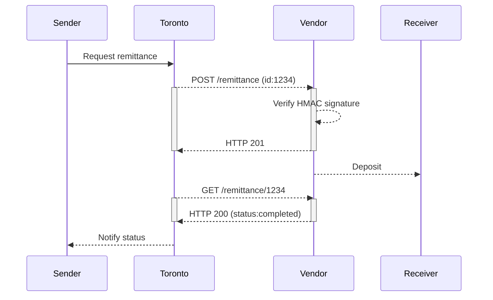

# Local Remittance Vendor
The below document provides technical details for a local remittance vendor to integrate with the Toronto remittance platform.

## Flows
### Basic bank deposit remittance flow
[](https://mermaid-js.github.io/mermaid-live-editor/#/edit/eyJjb2RlIjoiXG5zZXF1ZW5jZURpYWdyYW1cbiAgICBwYXJ0aWNpcGFudCBTZW5kZXJcbiAgICBwYXJ0aWNpcGFudCBUb3JvbnRvXG4gICAgcGFydGljaXBhbnQgVmVuZG9yXG4gICAgcGFydGljaXBhbnQgUmVjZWl2ZXJcbiAgICBTZW5kZXItPj5Ub3JvbnRvOiBSZXF1ZXN0IHJlbWl0dGFuY2VcbiAgICBUb3JvbnRvLS0-PlZlbmRvcjogUE9TVCAvcmVtaXR0YW5jZSAoaWQ6MTIzNClcbiAgICBhY3RpdmF0ZSBUb3JvbnRvXG4gICAgYWN0aXZhdGUgVmVuZG9yXG4gICAgVmVuZG9yLS0-PlZlbmRvcjogVmVyaWZ5IEhNQUMgc2lnbmF0dXJlXG4gICAgVmVuZG9yLS0-PlRvcm9udG86IEhUVFAgMjAxXG4gICAgZGVhY3RpdmF0ZSBWZW5kb3JcbiAgICBkZWFjdGl2YXRlIFRvcm9udG9cbiAgICBWZW5kb3ItLT4-UmVjZWl2ZXI6IERlcG9zaXRcbiAgICBUb3JvbnRvLS0-PlZlbmRvcjogR0VUIC9yZW1pdHRhbmNlLzEyMzRcbiAgICBhY3RpdmF0ZSBUb3JvbnRvXG4gICAgYWN0aXZhdGUgVmVuZG9yXG4gICAgVmVuZG9yLS0-PlRvcm9udG86IEhUVFAgMjAwIChzdGF0dXM6Y29tcGxldGVkKVxuICAgIGRlYWN0aXZhdGUgVmVuZG9yXG4gICAgZGVhY3RpdmF0ZSBUb3JvbnRvXG4gICAgVG9yb250by0tPj5TZW5kZXI6IE5vdGlmeSBzdGF0dXMiLCJtZXJtYWlkIjp7InRoZW1lIjoiZGVmYXVsdCJ9LCJ1cGRhdGVFZGl0b3IiOmZhbHNlfQ)

  
Mermaid markup

## API Specification
In order to integrate, local remittance vendors must implement an API following the OpenAPI 3.0 spec as defined [here](https://raw.githubusercontent.com/loud-n-clear/toronto-specs/main/local-vendor-api.yml). You can view a user-friendly version using [Redocly](https://github.com/Redocly/redoc) by following [this link](http://redocly.github.io/redoc/?url=https://raw.githubusercontent.com/loud-n-clear/toronto-specs/main/vendor/local-vendor-api.yml)

Please see the spec for authentication & various status codes in the API spec for error code information.

## Assumptions
- Vendor & remittance originator will coordinate an offline process for updating exchange rates.

## Considerations
- Define rule for when a remittance is in "pending" status for too long?
- What happens if there is a discrepancy between the exchange rate we send and the exchange rate the vendor expects?
