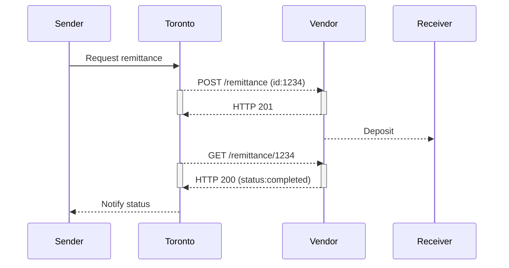

# Local Remittance Vendor

## Flows

## API
In order to integrate, local remittance vendors must implement an API following the OpenAPI 3.0 spec defined [here](https://raw.githubusercontent.com/loud-n-clear/toronto-specs/main/local-vendor-api.yml).

You can view a user-friendly version using [Redocly](https://github.com/Redocly/redoc) by following [this link](http://redocly.github.io/redoc/?url=https://raw.githubusercontent.com/loud-n-clear/toronto-specs/main/local-vendor-api.yml)

Please see the various status codes in the API spec for error code information.

## Considerations
- What happens if a remittance is in "pending" status for too long?
- What happens if there is a discrepancy between the exchange rate we send and the exchange rate the vendor expects?
